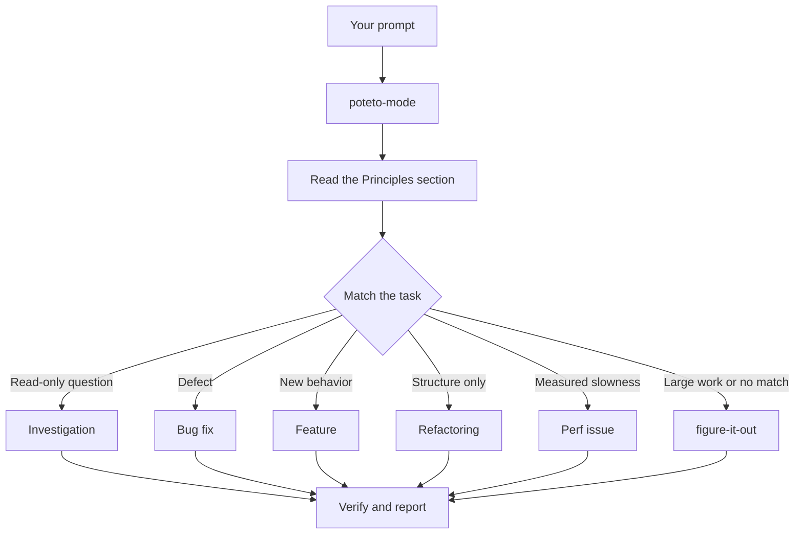

# `/poteto-mode` に作業を流す

`/poteto-mode` は玄関口である。ゴールを渡すと、23 本のプレイブックのうち 1 本にマッチさせ、そのプレイブックのステップを todo リストへコピーし、ステップが必要とするままに他の skill を呼ぶ。このページでは、良いプロンプトがどんなものか、そして実際にはどれだけ少なくて済むかを学ぶ。


## プロンプトに何が起きるか



図はよくある経路を示している。ほかにも、メトリクスのヒルクライム、ランタイムの症状と採取したトレースの診断、プロトタイプ、ビジュアルパリティ、skill の作成と評価、自律実行、PR やスタックを merge 可能な状態まで見守ること、検証済みスタックを出すこと、PR キューのオートパイロット実行、プロジェクト規模のプログラムのオーケストレーション、セッションの引き継ぎ、安全な中断、複数フェーズのプラン、worktree の掃除といったプレイブックがある。[プレイブックのディレクトリ](../../skills/poteto-mode/playbooks/) に全部が揃っている。

## 儀式ではなくゴールを言う

仕様書は書かない。何が壊れているか、何が欲しいかを言い、それに加えてエージェントの時間を節約できる既知の情報を添える:

```text
/poteto-mode users get two notifications after a retry. repro first, then fix and verify.
```

これは Bug fix のプロンプトである。「repro first」は礼儀ではなく実在の制約であり、プレイブックはそれを尊重する。todo リストが Bug fix のステップで埋まるのを見よ。飛ばされたステップは `skip: <reason>` 付きで見えたまま残る。

会話が既に文脈を抱えているなら、プロンプトはほとんど何もない状態まで縮む。以下はどれも十分である:

```text
/poteto-mode do it
```

```text
continue
```

```text
keep going until done
```

短くて済むのは、モードが sticky でプレイブックが構造を保持しているからである。あなたの言葉が意図を運び、skill が厳密さを運ぶ。

## 「new task」でタスクを切り替える

長いチャットは直前のタスクの文脈を溜め込む。話題を変えるときは、そう言うこと:

```text
/poteto-mode new task. figure out why the cache entry survives logout. don't change any code yet.
```

「new task」は `/poteto-mode` に、直前のプレイブックの続きではなく再マッチせよと伝える。「don't change any code yet」はこれを Investigation に固定する。この 2 つのフレーズがないと、Feature の途中にあるモードはあなたの質問を次の feature ステップとして扱いがちになる。

## 並列作業にはそれぞれの worktree を与える

1 つのリポジトリに対して複数のエージェントを走らせると、作業ツリーを奪い合う。最初に隔離を要求すること:

```text
/poteto-mode new task. branch off <base> in a fresh worktree, then port the parser change there.
```

各タスクが自分のブランチと worktree を持つなら、どのエージェントも他人のファイルを踏まない。[PR を開くプレイブック](../../skills/poteto-mode/playbooks/opening-a-pr.md) はコード変更に対して既に worktree から作業するので、これを言うのは特定のベースや場所が問題になるときだけでよい。

worktree は溜まっていく。ディスクが逼迫したら、こう頼む:

```text
/poteto-mode what's eating my disk? prune the worktrees that are safe to prune.
```

[Worktree cleanup プレイブック](../../skills/poteto-mode/playbooks/worktree-cleanup.md) は、マージ状態、未コミットの作業、まだ触っているチャットによって、すべての worktree を分類する。その証拠が問題ないと示したものだけを削除し、未コミットの作業を抱えるものについてはあなたの判断を待って止まる。

## 走らせたまま離れる

席を離れるときは、完了が何を意味するかを言って行けばよい:

```text
/poteto-mode im stepping away. keep going until the migration check reports zero old callers. log your decisions.
```

後から自分がレビューする作業は [`/figure-it-out`](../../skills/figure-it-out/SKILL.md) に流れる。これは実行のフェーズを設計し、[`/show-me-your-work`](../../skills/show-me-your-work/SKILL.md) の決定ログを維持する。[寝ている間に作業を走らせる](./07-overnight.ja.md) が夜間の契約の全体を扱う。

**落とし穴:** プロンプト内で skill を列挙しない (「use /how, then /architect, then /arena...」)。プレイブックが既にそれらを順序づけており、手書きの順序はたいてい、プレイブックなら残したはずのステップを並べ替えたり落としたりする。特定の選択を上書きしたいときにだけ skill 名を挙げること。

完全なルーティング規則は [`poteto-mode`](../../skills/poteto-mode/SKILL.md) 本体を読め。

次: [コードを理解する](./03-understand.ja.md)。
