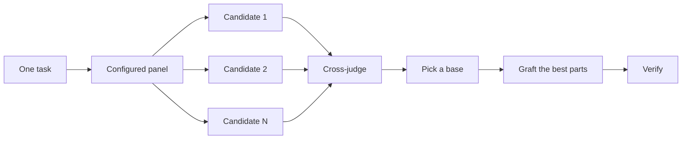

# コードを書く前に設計する

難しい設計を 1 回試すだけでは、モデルが最初に思いついた形を固定してしまう。`/architect` は実装の前に型と境界を決める。`/arena` は同じブリーフに対して複数回試み、最良の部分をマージする。`/interrogate` は他のモデルにその結果を壊させる。仕事が設計の統合ではなくカバレッジであるときは、`/swarm` がスライスやレースにファンアウトし、その結果を集約する。


## `/architect` で形を決める

```text
/architect design the import pipeline before writing any code. i care most about how callers use it.
```

[`/architect`](../../skills/architect/SKILL.md) はまず自らを grounding し、設計が触れるコードに対して `/how` を、所有権やレイヤーを動かすなら `/why` を走らせる。次に `/arena` を走らせて競合する設計スケッチを作る。各スケッチでは呼び出し側の使用例が最初に書かれ、続いて型、シグネチャ、モジュールマップが来る。

既定では、統合された設計からそのまま実装へ進む。先に設計を見たいなら、そう言うこと:

```text
/architect with checkpoint. stop and show me before implementing.
```

## `/arena` で試行をファンアウトする

```text
/arena take my prompt to the arena verbatim. i want to compare their proposals with yours.
```

[`/arena`](../../skills/arena/SKILL.md) はその下にある汎用のツールである。N 個のサブエージェントが同じ設計またはコードのブリーフに並列で取り組み、それぞれが自分の worktree またはディレクトリに書く。読み取り専用のジャッジが、設定が許すなら別のモデルファミリで、すべての候補をルーブリックに照らして採点する。コーディネータは各候補を端から端まで読み、ベースを選び、敗者から最良のアイデアを接ぎ木し、結果を検証する。



パネルは [`/setup-pstack`](../../skills/setup-pstack/SKILL.md) の設定から来る。タスクごとに調整できる。判断が重要なら候補を増やし、そうでなければ減らすよう頼む:

```text
/arena this, 5 candidates. the cache key format is expensive to change later.
```

## `/swarm` でスライスとレースをカバーする

```text
/swarm check every package under packages/ against its check.sh. one worker per package. one report.
```

[`/swarm`](../../skills/swarm/SKILL.md) は N 個のワーカーを、独立したスライス、カバレッジマトリクス、ガントレットのレーン、探索の分割、宣言されたレースのアームに広げる。各ワーカーは自分のスコープとチェックを受け取り、`PASS`、`ISSUES`、`BLOCKED` のいずれかを報告する。親はワーカーを待ち、ギャップや脱落を含む 1 つのコンパクトな報告を返す。

並列性がカバレッジを買うとき、または独立したチェックを競わせられるときに使う。`/arena` はすべてのワーカーに同じ設計またはコードのブリーフを渡し、その後ベースを選んで最良の部分を接ぎ木する。`/swarm` はスライスをカバーするか、あらかじめ宣言された選択規則でレースを走らせる。ベース選択と接ぎ木の儀式は使わない。

## `/interrogate` で壊す

```text
/interrogate the whole branch, but skeptically. no nitpicks unless it's an actual bug or regression.
```

[`/interrogate`](../../skills/interrogate/SKILL.md) は同じ diff、意図、ルーブリックを、異なるモデルファミリの複数のレビュワーに送る。モデルの多様性こそが要点である。モデルが違えば盲点も違うので、2 つのモデルが独立に挙げた指摘は確信度の高いシグナルである。リードはすべてを `Act on`、`Consider`、`Noted`、`Dismissed` に仕分けし、却下にはそれぞれ理由を付け、何も自動では適用しない。

却下も読むこと。リードは実務的なシニアエンジニアであって神託ではない。上書きしてよい。

## タスクにはどれだけの設計作業がふさわしいか

すべての変更にこれが必要なのかと思うかもしれない。必要ない。ほとんどの変更にはどれも要らない。おおまかな梯子:

- 小さく完成した変更で自信が持てないものには `/interrogate` だけでよい。
- 関数の境界を越える、または所有権を動かす変更は `/architect` に値する。`/architect` は `/arena` を連れてくる。
- 命名、フォーマット、アルゴリズムのように、独立した試行が役立つ単独の判断は `/arena` を直接使う。
- カバレッジマトリクス、並列チェックの集合、アームを宣言したレースは `/swarm`。
- 争点があり、覆すのが高くつく設計には `/architect`、そして出す前に `/interrogate`。

`/poteto-mode` はすでにこの梯子を適用している。境界を越える作業は自ずと `/architect` を起動するので、これらを直接使うのは主に、既定より多くの、あるいは少ない精査が欲しいときである。

次: [変更をビルドして綺麗にする](./05-build-and-clean.ja.md)。
