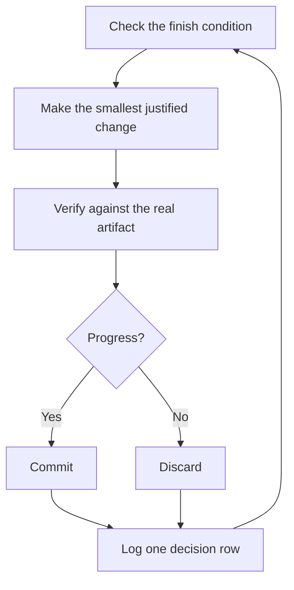

# 寝ている間に作業を走らせる

これがここまでの全ての見返りだ。自分の作業を自分で検証できると信頼できるエージェントは、難しいタスクを任せて放っておけるエージェントだ。それを安全にするのは希望的観測ではない。チェック可能な完了条件、隔離された worktree、そして朝に監査できる決定ログである。


## 一晩の契約

よい引き継ぎには、ゴール、完了条件、権限、そして脱出ハッチがある。長い必要はない:

```text
/poteto-mode im going to bed. migrate every caller to the new parser in a fresh worktree off <base>.
done means zero old callers, all parser fixtures pass, old api deleted.
keep a decision log. don't ask me before committing.
/loop until done. if you're truly stuck after a few hours, stop and write up why.
```

各行が何を買っているのかを見ていこう:

- 「im going to bed」はセッションのオーバーライドだ。エージェントは尋ねるのをやめ、進み続ける。
- 「done means...」はゴールを、各イテレーションが実行できるチェックに変える。
- 「fresh worktree off `<base>`」は、この実行が他に開いている作業と衝突しないようにする。
- 「don't ask me before committing」は、さもなければエージェントがブロックする権限確認に先回りして答えている。
- `/loop` は Cursor の組み込みの wake 機構であり、pstack の skill ではない。[Autonomous run playbook](../../skills/poteto-mode/playbooks/autonomous-run.md) はこれを使って、イベントまたは heartbeat のたびに完了条件を再チェックする。
- 脱出ハッチは、本物の行き止まりで止まって理由を書き残すことを許す。8 時間かけてゴールを創造的に解釈し直されるよりずっとよい。

この作業は席を外した後にレビューすることになるので、`/poteto-mode` はそれを [`/figure-it-out`](../../skills/figure-it-out/SKILL.md) 経由に回す。これはコードを書く前に実行のフェーズを設計し、決定ログを組み込む。

## ループが一晩やること



1 イテレーションにつき 1 変更、1 チェック、1 ログ行。役に立たなかった変更は、そのまま残さず破棄する。プラトーは停止ではなく方向転換を意味し、勝利宣言のために完了条件がこっそり緩むことはない。

## 朝の監査

[`/show-me-your-work`](../../skills/show-me-your-work/SKILL.md) が、この実行をレビュー可能にする。各行は時刻、フェーズ、決定、理由、証拠へのポインタ、結果を記録し、`decisions.tsv` (複数の実行が同じディレクトリを共有する場合は `.audit/<task-slug>.tsv`) の TSV に残る。既定ではローカルに留まる。レビュワーが結果を信頼するのに trail が要るほど野心的な作業なら、コミットする。

戻ってきたら、実行をレビュー形式で出させる:

```text
/show-me-your-work catch me up on what you did last night
```

この skill はサマリーを返す前に、別のモデルファミリーのレビュワーを起動して trail と transcript を読ませ、返答の末尾には注視すべきものを挙げた Attention セクションが付く。まずそのセクションを読み、次にそれが指すログ行を読む。監査しているのは決定であって、一晩ぶんを読み直すことではない。

## 夜が抱えるのがタスクではなくキューのとき

上の契約は、ひとつのタスクをひとつの完了条件まで駆動する。夜によってはそれ以上を抱える。独立した変更のキューや、プログラム全体だ。3 つの playbook が同じ信頼をスケールさせる。

[Autopilot-full](../../skills/poteto-mode/playbooks/autopilot-full.md) は独立した PR のキューを merge まで走らせる。各 PR には owner エージェントが 1 体つき、build から merge まで運ぶ。どの owner も自分の verdict では merge しない。新鮮な verifier の swarm は owner の code-ready な head でラウンドを開始し、patch を変える後続の push のたびに再び開始する。merge される patch に対する clean な verdict だけが merge を認可する:

```text
/poteto-mode full autopilot on this queue. each item is independent. i want them merged by morning.
```

[Autopilot-stack](../../skills/poteto-mode/playbooks/autopilot-stack.md) は同じ owner ループを走らせるが、何も出さない。起きると、各リンクに verifier の verdict が付いた 1 本の線形な base-branch スタックができており、レビューして自分で着地させる。変更が結合しているとき、あるいは何かが merge される前に自分の目で作業を見たいときは、Autopilot-full よりこちらを選ぶ:

```text
/poteto-mode autopilot these five changes but stack them, don't ship. i'll land the stack in the morning.
```

[Orchestrate](../../skills/poteto-mode/playbooks/orchestrate.md) は、単一のエージェントの寿命を超えるプログラム向けだ。複数日、多数のスタックされた PR、ひとつの常設 coordinator チャットの下にあるサブエージェントの群れ。coordinator は brief を書き、サブエージェントが仕上げたものを集め、最下位の未 merge PR を green に保ち、自分ではコードを書かない。意図的に重量級の機構である。1 体のエージェントが 1 セッションで終えられる作業なら、この playbook 自身が上の一晩の契約へ差し戻す:

```text
/poteto-mode orchestrate the store migration. own it until every package is converted and merged. i'll check in twice a day.
```

**落とし穴:** 時間の長さは完了条件ではない。「4 時間これをやって」ではエージェントにチェックすべきものが何も与えられず、起きたときにあるのは結果ではなく 4 時間ぶんの動きだ。`/loop` には合否を判定できる述語を与えること。

次: [原則の名前で舵を取る](./08-principles.ja.md)。
